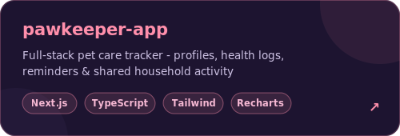
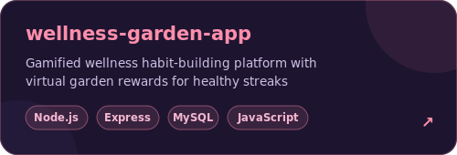
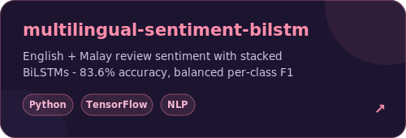
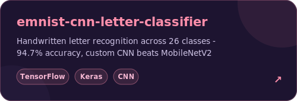
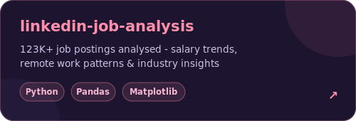
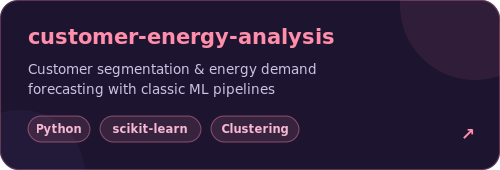

<div align="center">

<!-- banner -->


<!-- typing animation -->
<a href="https://github.com/c0smo-55">

</a>

<br/>

<!-- socials -->
<a href="https://www.linkedin.com/in/hannah-how"></a>
&nbsp;
<a href="https://www.instagram.com/hannahhow555"></a>
&nbsp;


<br/><br/>


</div>

<div align="center"></div>

## ✦ about me

```yaml
name: Hannah How
school: Singapore Polytechnic — Applied AI & Analytics
vibe: bubbly, curious, chronically multi-passionate
philosophy: "most students pick one lane. i refused."
open_to: [internships, collaborations, good conversations]
```

I build **AI models**, **full-stack apps** and **interfaces that don't look like everyone else's** —
and I believe being creative in one area makes you sharper in every other.

<div align="center"></div>

## ✦ skills & technologies

<div align="center">

**languages & core**


      

**ai & data**

 

          

**full-stack**


     

**ai tooling & automation**

   

    

</div>

<div align="center"></div>

## ✦ things i've built

<div align="center">

<a href="https://github.com/c0smo-55/pawkeeper-app"></a>
<a href="https://github.com/c0smo-55/fullstack-wellness-garden-app"></a>

<a href="https://github.com/c0smo-55/multilingual-sentiment-bilstm"></a>
<a href="https://github.com/c0smo-55/emnist-cnn-letter-classifier"></a>

<a href="https://github.com/c0smo-55/linkedin-job-analysis"></a>
<a href="https://github.com/c0smo-55/aiml-customer-energy-analysis"></a>

</div>

<div align="center"></div>

## ✦ a little more about me — click to open

<details>
<summary><b>what i obsess over</b></summary>
<br/>

- UI/UX — if users have to think about it, I redesign it
- Apple-style minimalism — every pixel earns its place
- Glassmorphism — blur, depth, frosted-glass magic
- Motion-based storytelling — interfaces that feel alive

</details>

<details>
<summary><b>what i'm exploring</b></summary>
<br/>

- Agentic coding with Claude Code & Kimi Code
- AI image & video with Higgsfield
- Taught OpenClaw to autonomously draft & send outreach emails to the right people while I sleep
- Staying on the edge and shipping these tools into real projects

</details>

<details>
<summary><b>outside of tech</b></summary>
<br/>

- Photography — chasing light
- Art & baking — hands-on creativity
- Aquascaping — tiny underwater worlds, carefully designed
- Content creation — telling stories in every medium

</details>

<details>
<summary><b>leadership</b></summary>
<br/>

**Publicity — SP School of Computing**

Open House · MINDEF Sentinel · Industry Connect · FOC · FOP

</details>

<div align="center"></div>

## ✦ github, in numbers

<div align="center">

<a href="https://github.com/c0smo-55"></a>
<a href="https://github.com/c0smo-55?tab=repositories"></a>

<br/><br/>

<picture>
  <source media="(prefers-color-scheme: dark)" srcset="https://streak-stats.demolab.com?user=c0smo-55&hide_border=true&background=00000000&ring=ff8fab&fire=f07a9b&currStreakLabel=ff8fab&currStreakNum=ffffff&sideNums=ffffff&sideLabels=f7b9d4&dates=cfc4e6"/>
  
</picture>

</div>

<div align="center"></div>

## ✦ snake break

*watch it munch through my commits~*

<div align="center">
<picture>
  <source media="(prefers-color-scheme: dark)" srcset="https://raw.githubusercontent.com/c0smo-55/c0smo-55/output/github-contribution-grid-snake-dark.svg"/>
  <source media="(prefers-color-scheme: light)" srcset="https://raw.githubusercontent.com/c0smo-55/c0smo-55/output/github-contribution-grid-snake.svg"/>
  
</picture>
</div>

<div align="center"></div>

<div align="center">

## ✦ let's talk

open to **internships**, **collaborations** and **good conversations** —
my inbox is friendlier than my commit history

<a href="https://www.linkedin.com/in/hannah-how"></a>

<br/><br/>

🌷 *psst… my garden is alive — look closely* 🌷



*made with too much matcha and just the right amount of chaos*

</div>
